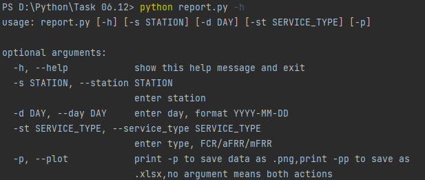

#Report Module

Task 06.12 

 A module which can create database, fill it with data from .xlsx, get reports as plots using .png format 
 and tables using .xlsx format from created database.

## Installation
1.Get clone
```sh
   git clone https://github.com/Sloth04/Task_06.12.git
```
2.Install all libraries from requirements.txt using
```sh
  pip install -r requirements.txt #(Python 2)
```
```sh
  pip3 install -r requirements.txt #(Python 3)
```

##Usage
1.Run model_db.py to create empty shell of your database.

To change database name, enter your name in `config.py` (32 line), ends with `.sqlite`
```sh
  DATABASE_NAME = 'Task_06_12.sqlite'
```

2.To fill your database run `insert.py`

All data from input*.xlsx files will be added to your DB.
You will be warned in logger if some lines is new and added to your `DATABASE_NAME`

3.To get report run `report.py`
```sh
  python report.py
```
 If you need additional options check it with 
```sh
  python report.py -h
```


All arguments are optional 

Clear run with no arguments use default values
station='62W001'
day='2021-05-16'
service_type='FCR'

##Contact
Sloth04 - sloth04ua@gmail.com

Project Link: https://github.com/Sloth04/Task_06.12.git
